# UCA Digital Assistant - Explication detaillee du projet

## 1. Idee generale

**UCA Digital Assistant** est une application web intelligente destinee aux etudiants de l'Universite Cadi Ayyad.

Son objectif est d'aider l'etudiant a retrouver rapidement des informations fiables sur les services, plateformes et procedures universitaires.

Le sujet de stage est propose par le **Pole Digitalisation de la Presidence de l'Universite Cadi Ayyad**. Cela donne au projet un cadre institutionnel clair : il ne s'agit pas seulement d'une experimentation technique, mais d'une reponse a un besoin lie a la transformation numerique des services universitaires.

Le projet ne se limite pas a un simple chatbot. Il combine :

- une application web Django ;
- une interface de chat etudiante ;
- un historique des conversations ;
- un feedback utilisateur ;
- un dashboard administrateur ;
- une architecture RAG ;
- une recherche hybride FAISS + BM25 ;
- une generation de reponse avec sources et niveau de confiance ;
- une evaluation mesurable du systeme.

Phrase centrale :

> Le systeme cherche d'abord dans les documents UCA, puis genere une reponse contextualisee et verifiable.

En termes simples, le projet transforme un ensemble de documents et de sources universitaires en un assistant conversationnel capable d'aider l'etudiant a trouver la bonne information sans devoir chercher manuellement dans plusieurs espaces.

## 1.1 Cadre du stage

Le stage s'inscrit dans un contexte de digitalisation des services universitaires.

Le **Pole Digitalisation de la Presidence de l'UCA** a pour role de soutenir les initiatives numeriques, d'ameliorer l'acces aux services et de rendre les informations plus accessibles.

Dans ce cadre, le projet vise a explorer l'apport de l'intelligence artificielle generative et du RAG dans un environnement universitaire.

Acteurs principaux :

| Acteur | Role dans le projet |
|---|---|
| Etudiant | pose des questions et consulte les reponses |
| Administrateur | supervise le corpus, les audits et les metriques |
| Pole Digitalisation | propose le sujet et donne le cadre numerique |
| Documents UCA | fournissent la base de connaissance |
| Systeme RAG | cherche les passages pertinents et aide a generer la reponse |

Le projet a donc deux dimensions :

- une dimension **fonctionnelle**, car il doit etre utilisable par un etudiant ;
- une dimension **technique**, car il implemente une architecture RAG complete ;
- une dimension **institutionnelle**, car il s'inscrit dans la digitalisation de l'UCA.

## 2. Probleme traite

Dans un contexte universitaire, les informations utiles existent, mais elles sont souvent reparties entre plusieurs sources :

- sites web officiels de l'UCA ;
- plateformes numeriques universitaires ;
- documents administratifs ;
- services administratifs ;
- canaux de communication.

Pour un etudiant, cela peut rendre la recherche lente et confuse.

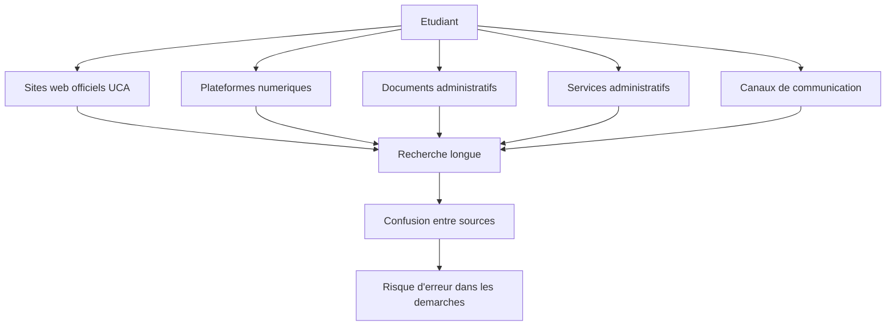

Le probleme principal n'est donc pas l'absence d'information, mais la difficulte d'acceder rapidement a la bonne information.

### 2.1 Causes du probleme

Plusieurs facteurs expliquent cette difficulte :

| Cause | Explication |
|---|---|
| Multiplication des sources | l'information est repartie entre sites, plateformes, documents et services |
| Formats heterogenes | les informations peuvent etre dans des pages web, PDF, DOCX, annonces ou messages |
| Vocabulaire administratif | certains termes comme PEDOC, UC@Student, UCAPLAT ou CIP ne sont pas toujours clairs pour tous les etudiants |
| Evolution des procedures | les procedures peuvent changer avec le temps |
| Absence de point d'acces unique | l'etudiant doit souvent savoir a l'avance ou chercher |

### 2.2 Consequences pour l'etudiant

Pour l'etudiant, ces difficultes peuvent provoquer :

- une perte de temps ;
- une confusion entre plusieurs services ;
- une dependance aux services administratifs pour des questions simples ;
- une mauvaise orientation vers une plateforme ou une procedure ;
- une difficulte a verifier si l'information trouvee est fiable ;
- un risque d'utiliser une information ancienne ou incomplete.

### 2.3 Besoin identifie

Le besoin peut etre resume ainsi :

> Offrir a l'etudiant un point d'acces conversationnel capable de rechercher dans des sources universitaires fiables, de donner une reponse claire et d'indiquer les documents utilises.

Le projet ne cherche donc pas a remplacer les services administratifs. Il cherche plutot a faciliter l'acces aux informations deja disponibles et a reduire les recherches repetitives.

## 3. Objectif du projet

L'objectif est de proposer un assistant capable de :

- comprendre une question en langage naturel ;
- rechercher dans les documents et services UCA ;
- retrouver les passages pertinents ;
- generer une reponse contextualisee ;
- afficher les sources ;
- indiquer un niveau de confiance ;
- conserver l'historique de conversation ;
- permettre le feedback etudiant ;
- offrir une supervision administrateur.

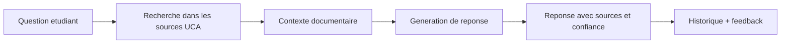

### 3.1 Objectif general

L'objectif general est de concevoir et developper un assistant universitaire intelligent permettant aux etudiants de l'UCA d'obtenir des reponses fiables a partir de sources documentaires internes ou officielles.

### 3.2 Objectifs specifiques

Le projet vise plusieurs objectifs specifiques :

| Objectif | Description |
|---|---|
| Centraliser l'acces | permettre a l'etudiant de poser une question depuis une seule interface |
| Ameliorer la fiabilite | generer des reponses basees sur des documents recuperes |
| Rendre la reponse verifiable | afficher les sources et un niveau de confiance |
| Conserver le contexte | gerer l'historique et les questions de suivi |
| Superviser le systeme | proposer un dashboard admin pour suivre corpus, audits et metriques |
| Evaluer le systeme | mesurer le comportement du retrieval, du contexte et de l'application |

### 3.3 Ce que le projet apporte

Le projet apporte une valeur concrete a trois niveaux :

- pour l'etudiant : une reponse rapide, claire et accompagnee de sources ;
- pour l'administration : une reduction potentielle des questions repetitives ;
- pour le Pole Digitalisation : un prototype technique evaluable pour explorer l'usage du RAG dans les services universitaires.

### 3.4 Ce que le projet ne pretend pas faire

Il est important de presenter le projet de maniere honnete.

Le systeme ne remplace pas :

- les decisions administratives officielles ;
- les services de scolarite ;
- les textes reglementaires officiels ;
- les plateformes existantes.

Il agit comme un assistant d'orientation et d'information, base sur les documents disponibles.

## 4. Pourquoi utiliser RAG ?

Un chatbot base uniquement sur un LLM peut produire une reponse fluide, mais non verifiee. Il peut generaliser ou halluciner.

Dans un contexte universitaire, la reponse doit etre :

- fiable ;
- verifiable ;
- liee aux sources ;
- adaptee au contexte UCA.

Le RAG, ou **Retrieval-Augmented Generation**, repond a ce besoin.

Principe :

1. le systeme recupere d'abord des passages pertinents dans les documents ;
2. ces passages deviennent le contexte ;
3. le modele genere une reponse a partir de ce contexte ;
4. la reponse est accompagnee de sources.

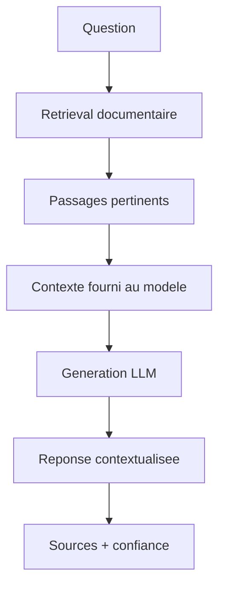

Comparaison :

| Approche | Limite | Apport |
|---|---|---|
| Recherche classique | retourne surtout des liens | utile mais peu conversationnel |
| LLM seul | risque d'hallucination | reponse fluide |
| RAG | depend de la qualite du corpus | reponse ancree dans les sources |

## 5. Fonctionnalites principales

Le projet contient deux espaces principaux.

### 5.1 Espace etudiant

L'espace etudiant permet de :

- creer un compte ;
- se connecter ;
- acceder a un chat protege ;
- poser des questions ;
- consulter l'historique ;
- utiliser plusieurs conversations ;
- voir les sources ;
- voir le niveau de confiance ;
- donner un feedback positif ou negatif.

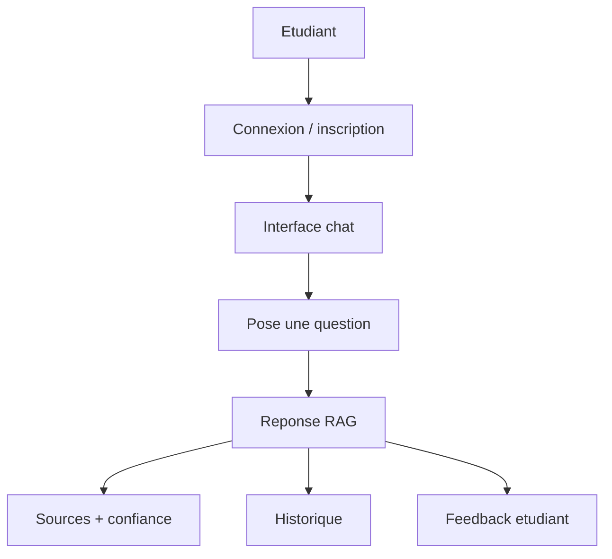

### 5.2 Espace administrateur

L'espace administrateur permet de :

- suivre l'etat global du RAG ;
- consulter le dashboard ;
- gerer les documents Drive ;
- lancer des audits qualite ;
- lancer des benchmarks ;
- consulter les conversations ;
- analyser les feedbacks ;
- suivre la maintenance du systeme.

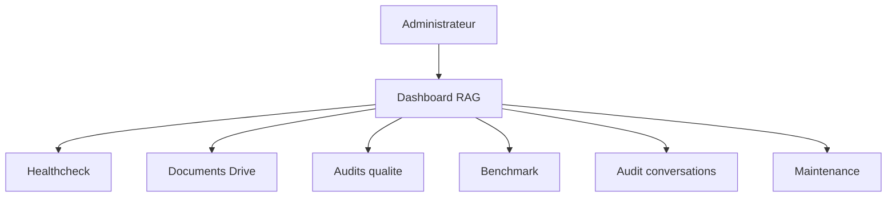

### 5.3 Parcours type d'un etudiant

Le parcours etudiant peut etre explique en plusieurs etapes :

1. l'etudiant se connecte a l'application ;
2. il ouvre l'interface de chat ;
3. il pose une question en langage naturel ;
4. le systeme recherche les passages pertinents dans les documents ;
5. l'assistant genere une reponse ;
6. l'etudiant consulte les sources et le niveau de confiance ;
7. il peut continuer la conversation avec une question de suivi ;
8. il peut donner un feedback positif ou negatif.

Exemple :

```text
Etudiant : Ou consulter mes notes sur UC@Student ?
Assistant : Vous pouvez consulter vos notes via la plateforme UC@Student...
Sources : document UC@Student, service scolarite
Confiance : elevee
```

### 5.4 Parcours type d'un administrateur

Le parcours administrateur est different.

L'administrateur ne vient pas poser des questions comme l'etudiant. Il supervise le systeme.

Etapes principales :

1. acceder au dashboard ;
2. verifier l'etat du systeme RAG ;
3. consulter les documents disponibles ;
4. lancer ou consulter les audits qualite ;
5. analyser les conversations et les feedbacks ;
6. observer les metriques de benchmark ;
7. identifier les limites du corpus ou du retrieval.

Cela permet de suivre si le systeme reste utilisable et coherent.

### 5.5 Fonctionnalites importantes a citer pendant la soutenance

Les fonctionnalites les plus importantes a mentionner sont :

- authentification ;
- interface chat ;
- conversations multiples ;
- historique ;
- reponses avec sources ;
- niveau de confiance ;
- feedback etudiant ;
- dashboard admin ;
- healthcheck RAG ;
- audits documentaires ;
- benchmark de retrieval ;
- analyse des conversations.

Il ne faut pas seulement dire "j'ai fait un chatbot". Il faut dire :

> J'ai developpe une application web complete autour d'un moteur RAG, avec une partie utilisateur, une partie administrateur, des sources, des metriques et une evaluation.

## 6. Architecture globale

L'architecture est organisee en couches.

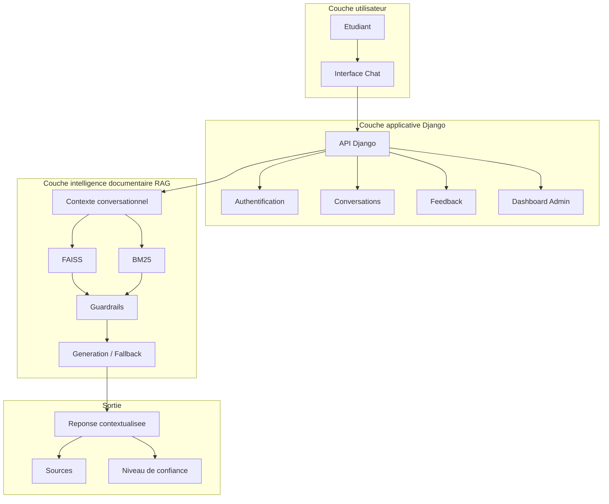

Cette separation rend le systeme plus clair :

- Django gere la partie application web ;
- le module RAG gere la recherche et la generation ;
- l'administrateur supervise le systeme ;
- l'etudiant recoit une reponse avec sources.

### 6.1 Modules principaux

| Module | Responsabilite |
|---|---|
| Interface chat | afficher les conversations et envoyer les questions |
| Authentification | proteger l'acces aux espaces utilisateur et admin |
| Gestion des conversations | stocker les messages, l'historique et les sessions |
| Module RAG | rechercher les passages et produire une reponse contextualisee |
| Module documents | gerer les fichiers, chunks, metadonnees et index |
| Dashboard admin | afficher et superviser les etats, audits et metriques |
| Feedback | collecter l'avis de l'utilisateur sur les reponses |
| Benchmarks | evaluer la qualite du retrieval et du contexte |

### 6.2 Donnees manipulees

Le systeme manipule plusieurs types de donnees :

| Donnee | Exemple | Utilisation |
|---|---|---|
| Utilisateur | etudiant ou admin | authentification et droits |
| Conversation | session de chat | conserver le fil de discussion |
| Message | question ou reponse | historique et analyse |
| Document | fichier DOCX, PDF, page | source de connaissance |
| Chunk | passage decoupe | unite de recherche RAG |
| Embedding | vecteur numerique | recherche semantique FAISS |
| Source | document utilise | verification de la reponse |
| Feedback | utile / non utile | amelioration et analyse |
| Metrique | top-1, hit@k, latence | evaluation du systeme |

### 6.3 Pourquoi cette architecture est adaptee

Cette architecture est adaptee car elle separe clairement :

- l'interface utilisateur ;
- la logique applicative ;
- la recherche documentaire ;
- la generation ;
- la supervision ;
- l'evaluation.

Cette separation facilite :

- la maintenance ;
- les tests ;
- l'evolution future ;
- le remplacement de certains composants.

Exemple : FAISS peut etre remplace plus tard par Qdrant sans devoir refaire toute l'application.

## 7. Phase offline : construction de la base documentaire

La phase offline est executee avant l'utilisation par l'etudiant.

Elle transforme les documents bruts en base documentaire interrogeable.

Sources possibles :

- documents Drive ;
- fichiers PDF ;
- fichiers DOCX ;
- pages HTML ;
- fichiers TXT ou MD ;
- documents officiels UCA.

Pipeline offline :

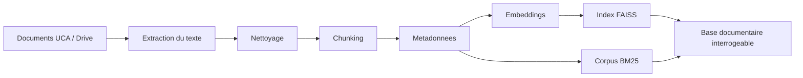

Role de chaque etape :

| Etape | Role |
|---|---|
| Extraction | recuperer le texte depuis les documents |
| Nettoyage | supprimer le bruit et les contenus inutiles |
| Chunking | decouper le texte en passages exploitables |
| Metadonnees | ajouter source, service, type, langue, etc. |
| Embeddings | transformer les passages en vecteurs semantiques |
| FAISS | indexer les vecteurs pour la recherche semantique |
| BM25 | preparer la recherche lexicale par mots-cles |

### 7.1 Vue globale du corpus documentaire

Le corpus documentaire est la base de connaissance du systeme.

Il contient principalement des documents lies aux services, plateformes et procedures de l'UCA.

Dans l'analyse du dossier Drive, les donnees observees indiquent :

| Element | Valeur observee |
|---|---:|
| Documents DOCX principaux | 14 |
| Fichiers bruts analyses | 48 |
| Chunks construits | 30 |
| Sources uniques | 16 |

Types de documents observes :

| Type | Nombre approximatif |
|---|---:|
| Scolarite | 18 |
| Ressources humaines | 5 |
| Recherche | 5 |
| Pedagogie numerique | 2 |

Ces chiffres montrent que le corpus est utile pour une demonstration, mais qu'il doit encore etre enrichi pour couvrir plus largement tous les besoins etudiants.

### 7.2 Importance de la qualite du corpus

Dans un systeme RAG, la qualite des reponses depend fortement de la qualite des documents.

Si les documents sont :

- incomplets ;
- mal structures ;
- anciens ;
- ambigus ;
- mal decoupes ;

alors le systeme peut recuperer un contexte insuffisant ou produire une reponse moins utile.

Le RAG ne cree pas une verite a partir de rien. Il s'appuie sur ce qui existe dans le corpus.

### 7.3 Chunking

Le chunking consiste a decouper un document en passages plus petits.

Pourquoi decouper ?

- un document entier est souvent trop long pour etre utilise directement ;
- la recherche doit retrouver un passage precis, pas seulement un fichier ;
- le modele de langage a une limite de contexte ;
- des chunks bien decoupes ameliorent la pertinence du retrieval.

Exemple :

```text
Document : Guide UC@Student
Chunk 1 : Presentation de la plateforme
Chunk 2 : Consultation des notes
Chunk 3 : Reclamations ou procedures associees
```

Un bon chunk doit etre assez petit pour etre precis, mais assez grand pour garder le sens.

### 7.4 Metadonnees

Les metadonnees donnent du contexte aux chunks.

Exemples :

- nom du document ;
- service concerne ;
- type de document ;
- langue ;
- date ;
- source ;
- categorie ;
- chemin du fichier.

Les metadonnees sont utiles pour :

- afficher les sources ;
- filtrer les resultats ;
- analyser les erreurs ;
- comprendre pourquoi un passage a ete recupere ;
- ameliorer le dashboard administrateur.

## 8. Phase online : traitement d'une question

La phase online commence quand l'etudiant pose une question dans le chat.

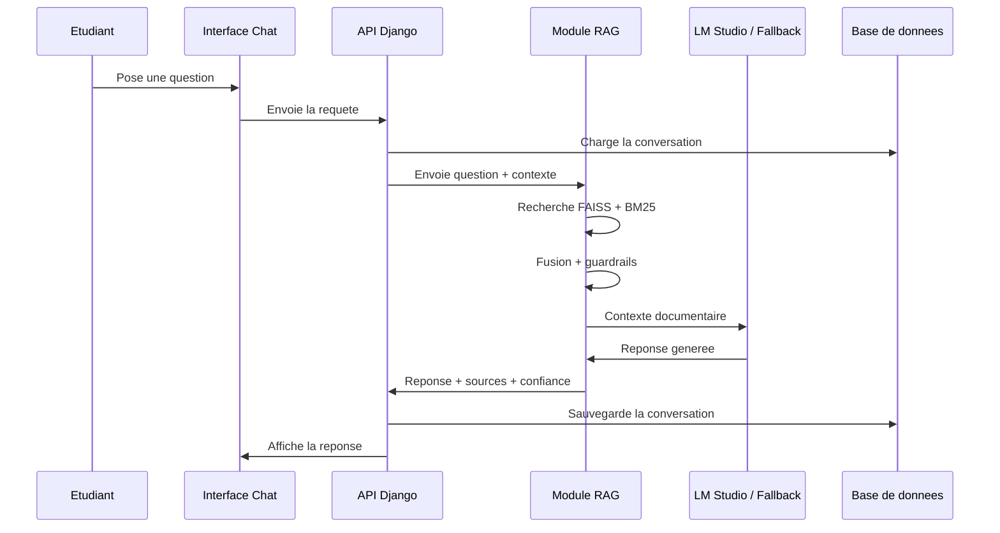

Etapes principales :

1. l'etudiant pose une question ;
2. Django recupere la conversation ;
3. le contexte conversationnel est analyse ;
4. le module RAG lance la recherche hybride ;
5. les guardrails filtrent les resultats ;
6. le systeme genere ou extrait une reponse ;
7. l'interface affiche la reponse avec sources.

### 8.1 Niveau de confiance

Le niveau de confiance n'est pas une garantie absolue.

Il indique plutot si le systeme a trouve un contexte documentaire suffisamment pertinent pour repondre.

Il peut dependre de plusieurs elements :

- score des passages recuperes ;
- coherence entre la question et les chunks ;
- nombre de sources utiles ;
- presence de mots exacts importants ;
- qualite du contexte transmis au modele.

Interpretation possible :

| Niveau | Sens |
|---|---|
| Eleve | le contexte documentaire semble solide |
| Moyen | des informations utiles sont trouvees, mais avec prudence |
| Faible | le systeme n'a pas assez de contexte fiable |

### 8.2 Sources affichees

Les sources sont essentielles dans un contexte universitaire.

Elles permettent :

- de verifier l'origine de la reponse ;
- de reduire la confiance aveugle dans l'IA ;
- de revenir au document officiel ;
- d'expliquer pourquoi le systeme a donne cette reponse.

Une reponse sans source serait moins credible pour un usage universitaire.

### 8.3 Fallback

Le fallback est une reponse de secours.

Il peut etre utilise quand :

- le modele de langage est indisponible ;
- LM Studio est trop lent ;
- le contexte est insuffisant ;
- la generation echoue ;
- le systeme prefere extraire une information plutot que generer une reponse risquee.

Le fallback permet de garder une application plus robuste.

## 9. Recherche hybride : FAISS + BM25

Le projet utilise deux moteurs de recherche complementaires.

### FAISS

FAISS est utilise pour la recherche semantique.

Il permet de retrouver des passages proches du sens de la question, meme si les mots exacts ne sont pas les memes.

Exemple :

> "Comment acceder a mes cours en ligne ?"

peut retrouver des passages parlant de plateforme pedagogique ou d'UCAPLAT.

### BM25

BM25 est utilise pour la recherche lexicale.

Il valorise les mots exacts et les noms de services.

Exemple :

> "Comment candidater sur PEDOC ?"

BM25 donne de l'importance au mot **PEDOC**.

### Fusion

Les resultats FAISS et BM25 sont fusionnes, puis filtres par des guardrails.

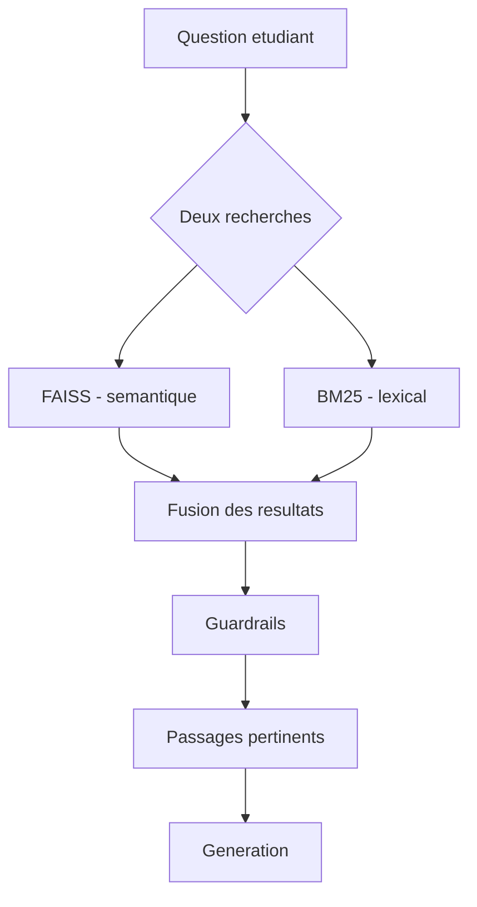

Avantage :

- FAISS comprend le sens ;
- BM25 securise les mots exacts ;
- la fusion ameliore la robustesse du retrieval.

## 10. Guardrails et abstention

Les guardrails servent a eviter de donner une reponse faible ou hors sujet.

Ils permettent de :

- verifier la pertinence des passages ;
- reduire les confusions entre services ;
- filtrer certains resultats faibles ;
- eviter de repondre quand le contexte est insuffisant.

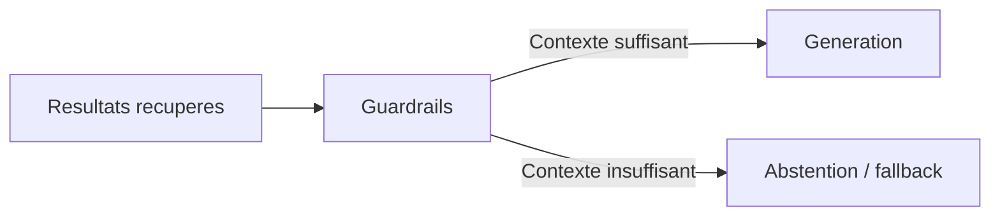

Message important :

> Un bon assistant universitaire doit parfois refuser de repondre plutot que produire une reponse non fiable.

## 11. Generation de reponse

Apres le retrieval, le systeme construit un prompt avec les passages pertinents.

La generation peut se faire avec :

- LM Studio ;
- un modele compatible API OpenAI ;
- un fallback extractif si le LLM est lent ou indisponible.

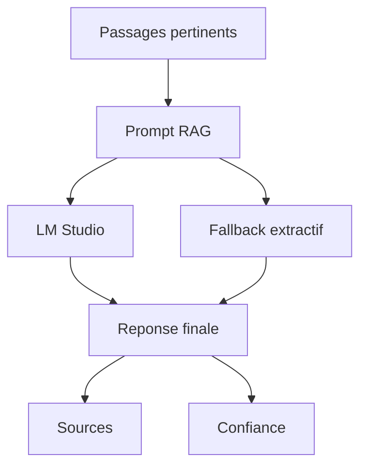

La reponse finale contient :

- le texte de la reponse ;
- les sources ;
- le niveau de confiance ;
- des metadonnees de retrieval.

## 12. Gestion du contexte conversationnel

Le systeme ne traite pas seulement les questions de maniere isolee.

Il peut utiliser le contexte de conversation.

Exemple :

```text
Etudiant : Comment candidater sur PEDOC ?
Assistant : ...
Etudiant : Et les documents necessaires ?
```

La deuxieme question ne repete pas "PEDOC", mais le contexte permet de comprendre que l'etudiant parle encore du meme service.

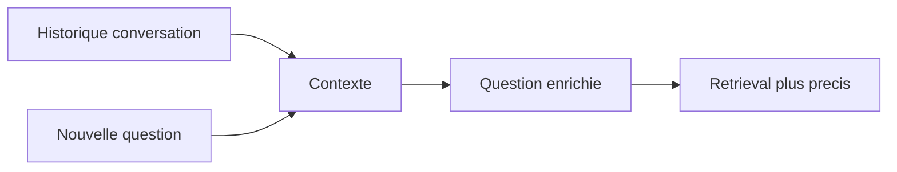

## 12.1 Module RAG : technologies utilisees par etape

Cette section explique le fonctionnement interne du module RAG, et pour chaque etape : **quelle technologie est utilisee, pourquoi elle est utile, et comment elle intervient dans le systeme**.

### Etape 1 : Collecte des documents

**Technologies utilisees :**

- fichiers DOCX, PDF, HTML, TXT, MD ;
- dossier Drive local ;
- Python pour parcourir et preparer les fichiers.

**Pourquoi ?**

Le RAG a besoin d'une base documentaire. Sans documents fiables, le systeme ne peut pas fournir de reponses fiables.

Les documents representent la connaissance du systeme : procedures, plateformes, services, guides et informations administratives.

**Comment ?**

Les documents sont places dans un espace de stockage local. Le systeme les parcourt, identifie leur type, extrait leur contenu et conserve les informations utiles comme le nom du fichier, la source ou la categorie.

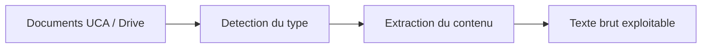

### Etape 2 : Extraction du texte

**Technologies utilisees :**

- bibliotheques Python d'extraction documentaire ;
- lecture DOCX pour les fichiers Word ;
- extraction PDF lorsque le document est au format PDF ;
- parsing HTML si la source est une page web.

**Pourquoi ?**

Les modeles de recherche et de generation ne travaillent pas directement sur un fichier Word ou PDF. Ils ont besoin de texte.

L'extraction transforme donc les fichiers bruts en texte utilisable par le pipeline RAG.

**Comment ?**

Le systeme lit chaque document selon son format, recupere le texte, puis l'envoie vers l'etape de nettoyage.

Exemple :

```text
Fichier DOCX/PDF -> extraction -> texte brut
```

### Etape 3 : Nettoyage du texte

**Technologies utilisees :**

- Python ;
- fonctions de normalisation de texte ;
- expressions regulieres si necessaire.

**Pourquoi ?**

Les textes extraits peuvent contenir du bruit :

- espaces inutiles ;
- sauts de ligne excessifs ;
- entetes ou pieds de page repetes ;
- caracteres parasites ;
- contenu vide ou peu utile.

Un texte bruite donne de mauvais chunks, donc de mauvais resultats de recherche.

**Comment ?**

Le systeme normalise le texte, supprime les parties inutiles et garde une version plus propre pour le decoupage.

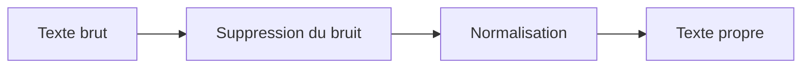

### Etape 4 : Chunking

**Technologies utilisees :**

- Python ;
- strategie de decoupage par taille, paragraphes ou sections ;
- conservation des metadonnees du document d'origine.

**Pourquoi ?**

Un document entier est trop long et trop general. Le RAG doit retrouver des passages precis.

Le chunking permet de transformer un document en petits passages exploitables.

Un bon chunk doit respecter deux conditions :

- assez court pour etre precis ;
- assez long pour garder le contexte.

**Comment ?**

Le systeme decoupe le texte en segments. Chaque chunk garde un lien avec son document source.

```text
Document complet
-> chunk 1 : presentation du service
-> chunk 2 : procedure d'acces
-> chunk 3 : conditions ou documents necessaires
```

### Etape 5 : Ajout des metadonnees

**Technologies utilisees :**

- structures de donnees Python ;
- base de donnees Django/SQLite ;
- champs de metadonnees associes aux chunks.

**Pourquoi ?**

Les metadonnees permettent de comprendre d'ou vient un passage et a quoi il correspond.

Elles sont indispensables pour :

- afficher les sources ;
- filtrer les resultats ;
- analyser les erreurs ;
- calculer certaines metriques ;
- aider l'administrateur a comprendre le corpus.

**Comment ?**

Chaque chunk est associe a des informations comme :

| Metadonnee | Role |
|---|---|
| source | connaitre le document d'origine |
| service | identifier le service concerne |
| type | distinguer guide, procedure, page, annonce |
| chemin | retrouver le fichier |
| langue | gerer le contenu multilingue si necessaire |
| date | savoir si l'information est recente ou ancienne |

### Etape 6 : Generation des embeddings

**Technologies utilisees :**

- Sentence-Transformers ou modele d'embedding compatible ;
- Python ;
- vecteurs numeriques.

**Pourquoi ?**

Les embeddings permettent de representer le sens d'un texte sous forme de vecteur.

Cette representation permet de comparer :

- une question etudiante ;
- un passage documentaire.

Si les deux vecteurs sont proches, cela signifie que les textes sont probablement proches en sens.

**Comment ?**

Le systeme transforme chaque chunk en vecteur. Plus tard, la question de l'etudiant sera transformee de la meme maniere.

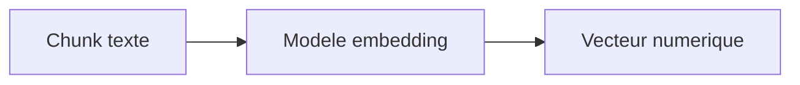

### Etape 7 : Indexation vectorielle avec FAISS

**Technologie utilisee :**

- FAISS.

**Pourquoi ?**

FAISS permet de faire une recherche rapide dans un grand ensemble de vecteurs.

Il est utilise pour la recherche semantique, c'est-a-dire la recherche par sens.

Exemple :

```text
Question : Comment acceder a mes cours en ligne ?
Document : Plateforme pedagogique UCAPLAT
```

Les mots ne sont pas identiques, mais le sens est proche. FAISS peut aider a retrouver ce passage.

**Comment ?**

Le systeme stocke les vecteurs des chunks dans un index FAISS. Quand une question arrive, elle est transformee en vecteur, puis FAISS cherche les vecteurs les plus proches.

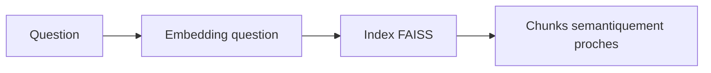

### Etape 8 : Indexation lexicale avec BM25

**Technologie utilisee :**

- BM25.

**Pourquoi ?**

BM25 est utile pour les mots exacts.

Dans un contexte universitaire, certains termes ne doivent pas etre approximatifs :

- UC@Student ;
- PEDOC ;
- UCAPLAT ;
- CIP ;
- inscription ;
- attestation ;
- scolarite.

FAISS peut comprendre le sens, mais BM25 est souvent meilleur pour retrouver un nom exact.

**Comment ?**

Le systeme construit un corpus lexical a partir des chunks. Quand une question arrive, BM25 calcule les passages qui contiennent les mots les plus pertinents.

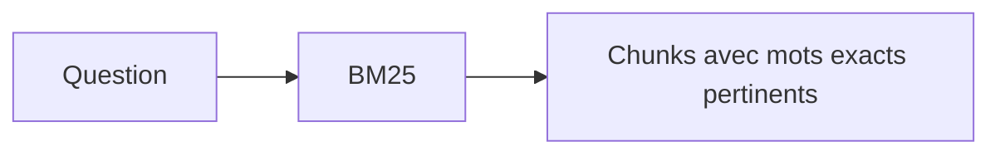

### Etape 9 : Recherche hybride

**Technologies utilisees :**

- FAISS ;
- BM25 ;
- logique de fusion des scores en Python.

**Pourquoi ?**

FAISS et BM25 ont chacun des avantages.

FAISS est fort pour le sens. BM25 est fort pour les mots exacts.

La recherche hybride combine les deux pour obtenir de meilleurs resultats.

**Comment ?**

Le systeme lance les deux recherches, recupere deux listes de resultats, puis les fusionne.

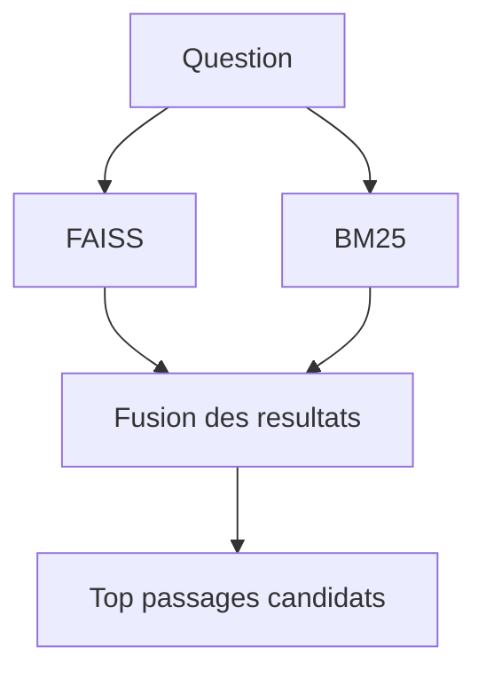

### Etape 10 : Reranking et selection du contexte

**Technologies utilisees :**

- Python ;
- scores FAISS/BM25 ;
- regles de selection ;
- metadonnees.

**Pourquoi ?**

Tous les passages recuperes ne doivent pas etre transmis au modele.

Il faut selectionner les meilleurs passages pour construire un contexte court, utile et coherent.

**Comment ?**

Le systeme classe les resultats selon leur score, leur source, leur service et leur pertinence. Ensuite, il garde les meilleurs chunks.

Objectif :

```text
Beaucoup de resultats candidats -> peu de passages vraiment utiles
```

### Etape 11 : Guardrails

**Technologies utilisees :**

- regles Python ;
- seuils de score ;
- verification des metadonnees ;
- logique d'abstention ou de fallback.

**Pourquoi ?**

Les guardrails limitent les reponses faibles ou hors sujet.

Ils sont importants dans un contexte universitaire, car il vaut mieux dire que l'information n'est pas disponible que donner une fausse reponse.

**Comment ?**

Le systeme verifie si les passages recuperes sont suffisants.

Si le contexte est bon, la generation peut continuer.

Si le contexte est faible, le systeme peut :

- reduire la confiance ;
- utiliser un fallback ;
- s'abstenir ;
- demander de reformuler.

### Etape 12 : Construction du prompt RAG

**Technologies utilisees :**

- template de prompt ;
- Python ;
- contexte documentaire ;
- historique de conversation.

**Pourquoi ?**

Le modele de langage doit recevoir une consigne claire.

Le prompt indique :

- la question de l'utilisateur ;
- les passages documentaires ;
- les regles de reponse ;
- la necessite de rester dans le contexte ;
- la demande d'afficher une reponse claire.

**Comment ?**

Le systeme construit un prompt qui contient la question et les meilleurs passages.

```text
Question utilisateur
+ passages recuperes
+ instructions de reponse
= prompt envoye au LLM
```

### Etape 13 : Generation avec LM Studio ou fallback

**Technologies utilisees :**

- LM Studio ;
- modele de langage local ;
- API compatible OpenAI ;
- fallback extractif.

**Pourquoi ?**

LM Studio permet d'executer localement un modele de langage pour generer une reponse naturelle.

Le fallback est utile si :

- LM Studio est lent ;
- le modele est indisponible ;
- le contexte ne permet pas une generation fiable.

**Comment ?**

Le systeme envoie le prompt au modele. Le modele produit une reponse en s'appuyant sur les passages fournis.

Si la generation ne convient pas, le systeme peut retourner une reponse plus extractive basee directement sur les chunks.

### Etape 14 : Reponse finale avec sources et confiance

**Technologies utilisees :**

- Django ;
- base de donnees ;
- interface chat ;
- metadonnees de retrieval.

**Pourquoi ?**

La reponse finale doit etre utilisable par l'etudiant et verifiable.

Elle ne doit pas etre seulement un texte genere.

Elle doit contenir :

- une reponse claire ;
- les sources ;
- le niveau de confiance ;
- parfois des informations de contexte ;
- la possibilite de feedback.

**Comment ?**

Django renvoie la reponse a l'interface. L'interface affiche le message, les sources et les actions disponibles.

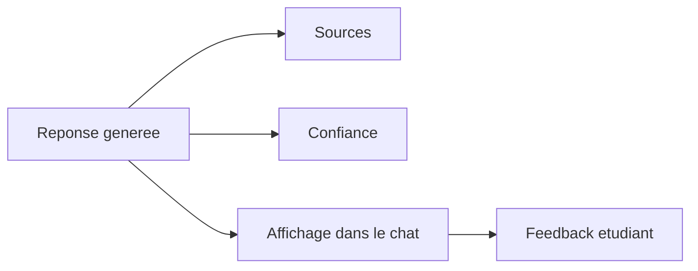

### Etape 15 : Sauvegarde et feedback

**Technologies utilisees :**

- Django ORM ;
- SQLite ;
- modeles Conversation, Message et Feedback ;
- dashboard administrateur.

**Pourquoi ?**

La sauvegarde permet de conserver l'historique et d'analyser l'usage du systeme.

Le feedback permet d'identifier les reponses utiles ou faibles.

**Comment ?**

Apres chaque interaction, le systeme enregistre :

- la question ;
- la reponse ;
- les sources ;
- le niveau de confiance ;
- les informations de retrieval ;
- le feedback eventuel.

Ces donnees peuvent ensuite etre consultees dans le dashboard.

### Synthese du module RAG

| Etape | Technologie principale | Role |
|---|---|---|
| Collecte | fichiers + Python | reunir les documents |
| Extraction | bibliotheques Python | transformer les fichiers en texte |
| Nettoyage | Python | supprimer le bruit |
| Chunking | Python | decouper en passages |
| Metadonnees | Django/SQLite | garder source, service, type |
| Embeddings | Sentence-Transformers | transformer texte en vecteurs |
| Recherche semantique | FAISS | retrouver les passages proches en sens |
| Recherche lexicale | BM25 | retrouver les mots exacts |
| Fusion | Python | combiner FAISS et BM25 |
| Guardrails | regles Python | eviter les reponses faibles |
| Prompt | template RAG | fournir contexte et consignes au LLM |
| Generation | LM Studio / fallback | produire la reponse |
| Affichage | Django + interface chat | montrer reponse, sources, confiance |
| Feedback | Django ORM + SQLite | enregistrer les retours utilisateur |

## 13. Evaluation et resultats

Le projet est evalue avec plusieurs indicateurs.

Resultats importants :

| Element | Resultat |
|---|---:|
| Tests Django cibles | 59 tests OK |
| Healthcheck RAG | ready = true |
| Service top-1 Drive | 92,31 % |
| Hit@k Drive | 61,54 % |
| BM25 hit@k | 84,62 % |
| Reecriture contextuelle | 93,75 % |
| Utilisation correcte du contexte | 93,75 % |

Interpretation :

- le retrieval est le point fort du projet ;
- BM25 est important pour les noms exacts de services ;
- le contexte conversationnel fonctionne bien ;
- la generation reste plus fragile que le retrieval ;
- la qualite du corpus influence fortement la qualite finale.

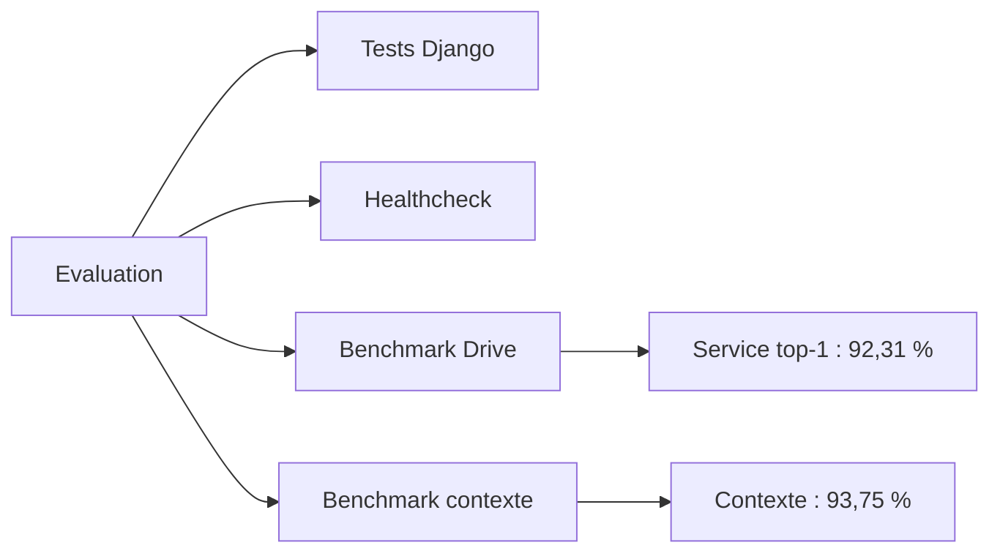

## 13.1 Securite et qualite logicielle

Le projet contient aussi des aspects non fonctionnels importants.

### Authentification

L'authentification permet de proteger l'acces a l'application.

Elle evite qu'un utilisateur non connecte accede directement aux conversations ou aux fonctions reservees.

### Separation des roles

Le projet distingue :

- l'espace etudiant ;
- l'espace administrateur.

Cette separation est importante, car l'administrateur a acces a des fonctions de supervision qui ne doivent pas etre disponibles pour un simple utilisateur.

### Tracabilite

La tracabilite permet de comprendre ce qui s'est passe dans le systeme.

Elle repose sur :

- les conversations sauvegardees ;
- les sources associees aux reponses ;
- les feedbacks ;
- les audits ;
- les benchmarks ;
- les metadonnees de retrieval.

### Maintenabilite

Le projet est organise en modules pour faciliter son evolution.

Par exemple :

- l'interface peut evoluer sans changer tout le RAG ;
- le moteur FAISS peut etre remplace par Qdrant ;
- SQLite peut etre remplace par PostgreSQL ;
- le modele local peut etre remplace par un autre provider compatible.

### Ergonomie

L'interface est pensee pour rester simple :

- chat clair ;
- historique visible ;
- sources accessibles ;
- dashboard lisible ;
- metriques presentees sous forme de cartes.

L'objectif est que l'utilisateur comprenne rapidement quoi faire.

## 14. Technologies utilisees et role

Le projet utilise plusieurs technologies. Chacune a un role precis dans l'architecture.

### 14.1 Django

**Role :** framework principal de l'application web.

Django gere :

- les routes web ;
- les vues ;
- l'authentification ;
- les sessions ;
- les templates HTML ;
- les modeles de donnees ;
- l'administration ;
- l'integration avec la base de donnees.

Dans ce projet, Django permet de construire l'application autour du moteur RAG.

Il ne sert pas seulement a afficher une page : il organise toute la couche applicative.

```mermaid
flowchart LR
    U[Utilisateur] --> V[Vues Django]
    V --> M[Modeles]
    V --> API[API Chat]
    API --> RAG[Module RAG]
    M --> DB[(Base de donnees)]
```

### 14.2 Django REST Framework

**Role :** creer des endpoints API pour le chat, les conversations, le feedback et le dashboard.

Il permet a l'interface JavaScript de communiquer avec le backend.

Exemples :

- envoyer une question ;
- recuperer les messages ;
- creer une conversation ;
- envoyer un feedback ;
- consulter les donnees du dashboard.

### 14.3 SQLite

**Role :** base de donnees locale de demonstration.

SQLite stocke :

- les utilisateurs ;
- les conversations ;
- les messages ;
- les sources associees aux reponses ;
- les niveaux de confiance ;
- les feedbacks ;
- les questions de benchmark.

SQLite est suffisant pour une version locale de demonstration. Pour une version production, PostgreSQL serait plus adapte.

### 14.4 HTML, CSS et JavaScript

**Role :** construire l'interface utilisateur.

HTML structure les pages.

CSS definit le style visuel : chat, sidebar, dashboard, cartes KPI, boutons.

JavaScript gere les interactions :

- envoyer les questions sans recharger la page ;
- afficher les messages ;
- gerer l'historique ;
- afficher les sources ;
- envoyer les feedbacks ;
- mettre a jour le dashboard admin.

### 14.5 FAISS

**Role :** moteur de recherche vectorielle.

FAISS permet de retrouver les passages proches du sens de la question.

Le principe :

1. chaque passage documentaire est transforme en vecteur ;
2. la question est aussi transformee en vecteur ;
3. FAISS cherche les vecteurs les plus proches.

FAISS est utile quand l'etudiant n'utilise pas exactement les memes mots que les documents.

Exemple :

```text
Question : Comment acceder a mes cours en ligne ?
Document : plateforme pedagogique UCAPLAT
```

FAISS peut rapprocher ces deux formulations car elles ont un sens proche.

### 14.6 BM25

**Role :** moteur de recherche lexicale.

BM25 cherche les mots exacts ou importants dans les documents.

Il est tres utile pour :

- les noms de services ;
- les acronymes ;
- les plateformes ;
- les mots administratifs precis.

Exemples :

- UC@Student ;
- PEDOC ;
- UCAPLAT ;
- CIP ;
- attestation ;
- inscription.

BM25 complete FAISS, car certains mots exacts ne doivent pas etre perdus.

### 14.7 Recherche hybride

**Role :** combiner FAISS et BM25.

FAISS apporte la comprehension semantique.

BM25 apporte la precision lexicale.

La fusion des deux donne une recherche plus robuste.

```mermaid
flowchart TD
    Q[Question etudiant] --> F[FAISS - sens]
    Q --> B[BM25 - mots exacts]
    F --> M[Fusion]
    B --> M
    M --> G[Guardrails]
    G --> P[Passages pertinents]
```

### 14.8 Sentence-Transformers / Embeddings

**Role :** transformer les textes en vecteurs numeriques.

Un modele d'embedding transforme :

- les chunks documentaires ;
- la question utilisateur ;

en representations vectorielles comparables.

Ces vecteurs sont ensuite utilises par FAISS.

### 14.9 LM Studio

**Role :** executer localement un modele de langage.

LM Studio fournit une API compatible avec l'API OpenAI.

Dans le projet, il sert a generer la reponse finale a partir du contexte documentaire retrouve.

Avantage :

- execution locale ;
- pas de dependance obligatoire a un service cloud ;
- utile pour une demonstration PFE.

Limite :

- generation lente sur un PC sans GPU dedie ;
- latence plus elevee que sur un serveur optimise.

### 14.10 Guardrails

**Role :** filtrer les resultats faibles ou hors sujet.

Les guardrails permettent de :

- verifier la pertinence des chunks ;
- limiter les confusions entre services ;
- eviter de produire une reponse avec un contexte insuffisant ;
- declencher un fallback ou une abstention si necessaire.

### 14.11 Docker

**Role :** faciliter l'execution de l'application dans un environnement reproductible.

Docker permet de regrouper l'application et ses dependances dans un conteneur.

Pour une demonstration, cela aide a reduire les problemes de configuration.

### 14.12 Qdrant

**Role :** vector store prevu comme evolution.

Dans la version actuelle, FAISS est utilise pour la demonstration locale.

Qdrant est une perspective plus adaptee a une version serveur ou production :

- stockage vectoriel persistant ;
- API reseau ;
- meilleure scalabilite ;
- administration plus simple en environnement deploiement.

### 14.13 PostgreSQL

**Role :** base de donnees prevue pour une future version production.

PostgreSQL remplacerait SQLite pour :

- plus de robustesse ;
- meilleure gestion multi-utilisateur ;
- meilleure securite ;
- meilleurs outils d'administration ;
- adaptation a un deploiement serveur.

## 15. Tests et metriques d'evaluation

Les tests servent a mesurer si le systeme fonctionne correctement.

Ils ne mesurent pas tous la meme chose. Certains testent l'application web, d'autres testent le retrieval, d'autres testent le contexte conversationnel.

### 15.1 Tests Django cibles

**Metrique :**

```text
59 tests OK
```

**Quoi ?**

Cette metrique indique que les tests automatises de l'application Django passent correctement.

Ils verifient notamment :

- l'authentification ;
- les vues ;
- les APIs ;
- le chat ;
- les conversations ;
- le feedback ;
- certaines fonctions de healthcheck ou d'integration.

**Comment ?**

Les tests sont lances avec une commande de type :

```bash
python manage.py test api_app.tests --keepdb
```

Django execute les tests et indique combien passent ou echouent.

**Pourquoi ?**

Ces tests prouvent que la couche applicative fonctionne et que les fonctionnalites principales ne sont pas cassees.

### 15.2 Healthcheck RAG

**Metrique :**

```text
ready = true
```

**Quoi ?**

Le healthcheck verifie si le systeme est pret a repondre.

Il ne suffit pas que le serveur soit lance. Le RAG doit aussi etre disponible.

**Comment ?**

Le systeme verifie plusieurs elements :

- base de donnees disponible ;
- index actif present ;
- fichiers FAISS disponibles ;
- chunks disponibles ;
- corpus BM25 present ;
- provider LLM utilisable.

**Pourquoi ?**

Cette metrique evite de dire que le systeme est pret alors que l'index ou le modele ne sont pas disponibles.

Difference importante :

| Etat | Sens |
|---|---|
| live | le serveur repond |
| ready | le systeme est vraiment pret pour le RAG |

### 15.3 Service top-1 Drive

**Metrique :**

```text
Service top-1 Drive = 92,31 %
```

**Quoi ?**

Cette metrique mesure si le premier resultat retrouve correspond au bon service attendu.

Exemple :

Si la question concerne PEDOC, le top-1 doit etre un document ou chunk lie a PEDOC.

**Comment ?**

Le benchmark contient des questions avec un service attendu.

Pour chaque question :

1. le systeme lance le retrieval ;
2. il recupere les resultats classes ;
3. il regarde le premier resultat ;
4. il compare le service retrouve avec le service attendu.

Formule simplifiee :

```text
Service top-1 accuracy = questions avec bon service en 1ere position / nombre total de questions
```

**Pourquoi ?**

C'est une metrique tres importante, car elle montre si le systeme oriente l'etudiant vers le bon service.

Un bon score top-1 indique que le retrieval est solide.

### 15.4 Hit@k Drive

**Metrique :**

```text
Hit@k Drive = 61,54 %
```

**Quoi ?**

Hit@k mesure si au moins un resultat pertinent se trouve parmi les k premiers resultats.

Par exemple, avec k = 5 :

> Est-ce qu'un bon document apparait dans les 5 premiers resultats ?

**Comment ?**

Pour chaque question :

1. le systeme recupere les k premiers resultats ;
2. il verifie si un resultat correspond aux criteres attendus ;
3. si oui, c'est un hit.

Formule :

```text
Hit@k = questions avec au moins un resultat pertinent dans le top k / nombre total de questions
```

**Pourquoi ?**

Cette metrique est utile car le premier resultat peut parfois ne pas etre parfait, mais un bon resultat peut quand meme exister dans les premiers passages.

Elle mesure donc la couverture utile du retrieval.

### 15.5 Precision@k

**Metrique :**

```text
Precision@k moyenne = 48,72 %
```

**Quoi ?**

Precision@k mesure la proportion de resultats pertinents parmi les k premiers resultats.

Exemple :

Si le top 5 contient 3 passages pertinents :

```text
Precision@5 = 3 / 5 = 60 %
```

**Comment ?**

Pour chaque question :

1. on regarde les k premiers resultats ;
2. on compte combien sont pertinents ;
3. on divise par k.

**Pourquoi ?**

Cette metrique mesure la qualite globale du classement.

Un score plus eleve signifie que les premiers resultats contiennent moins de bruit.

### 15.6 Coverage@k

**Metrique :**

```text
Coverage@k moyenne = 56,28 %
```

**Quoi ?**

Coverage@k mesure si les resultats recuperes couvrent suffisamment les informations attendues.

Ce n'est pas seulement "est-ce que le document est bon ?", mais aussi :

> Est-ce que les passages recuperes contiennent assez d'information pour repondre ?

**Comment ?**

Le benchmark compare les resultats aux elements attendus :

- service attendu ;
- mots-cles ;
- types de documents ;
- couverture du sujet.

**Pourquoi ?**

Un document peut etre du bon service, mais ne pas contenir le bon detail.

Coverage@k aide donc a mesurer la richesse informative des resultats.

### 15.7 BM25 hit@k

**Metrique :**

```text
BM25 hit@k = 84,62 %
```

**Quoi ?**

Cette metrique mesure la contribution de BM25 dans le benchmark.

Elle indique dans combien de cas BM25 retrouve un resultat pertinent dans les k premiers.

**Comment ?**

On lance ou on observe la partie BM25 du retrieval et on verifie si un bon resultat apparait dans le top k.

**Pourquoi ?**

Ce score est important car il montre que la recherche lexicale est tres utile pour les noms exacts de services.

Exemples :

- PEDOC ;
- UC@Student ;
- UCAPLAT ;
- CIP.

### 15.8 Dense hit@k

**Metrique :**

```text
Dense hit@k = 76,92 %
```

**Quoi ?**

Cette metrique mesure la contribution de la recherche vectorielle, donc FAISS.

Elle indique si FAISS retrouve un resultat pertinent dans les k premiers.

**Comment ?**

Le systeme compare la question et les chunks sous forme de vecteurs, puis verifie si les resultats denses contiennent un passage pertinent.

**Pourquoi ?**

Cette metrique montre si la recherche semantique comprend correctement le sens des questions.

Elle est utile quand les mots de la question ne sont pas exactement ceux du document.

### 15.9 Retrieval latency avg

**Metrique :**

```text
Retrieval latency avg
```

Exemple observe :

```text
environ 1,5 s a 2,8 s selon les rapports
```

**Quoi ?**

Cette metrique mesure le temps moyen necessaire pour retrouver les passages pertinents.

**Comment ?**

Pour chaque question, le systeme mesure le temps entre le debut du retrieval et la fin de la selection des resultats.

Puis il calcule une moyenne.

**Pourquoi ?**

La latence est importante pour l'experience utilisateur.

Un retrieval trop lent rendrait le chat moins fluide.

### 15.10 Useful answer rate

**Metrique :**

```text
Reponses utiles = 61,54 %
```

**Quoi ?**

Cette metrique mesure si la reponse finale generee est utile pour l'utilisateur.

Elle concerne la partie generation, pas seulement le retrieval.

**Comment ?**

Le benchmark compare la reponse produite avec les criteres attendus.

Une reponse est utile si elle :

- repond a la question ;
- reste dans le bon service ;
- s'appuie sur le contexte ;
- contient suffisamment d'informations.

**Pourquoi ?**

Un systeme RAG peut retrouver les bons documents, mais produire une reponse finale incomplete.

Cette metrique permet donc de separer :

- la qualite du retrieval ;
- la qualite de la generation.

### 15.11 Answer latency avg

**Metrique :**

```text
Latence moyenne de reponse generee
```

Exemple observe :

```text
environ 21,6 s avec LM Studio dans certains tests
```

**Quoi ?**

Cette metrique mesure le temps total pour produire la reponse finale avec generation.

**Comment ?**

Le systeme mesure le temps entre l'envoi de la question et la production de la reponse finale.

Cela inclut :

- retrieval ;
- construction du prompt ;
- appel a LM Studio ;
- generation ;
- formatage de la reponse.

**Pourquoi ?**

Cette metrique montre la limite principale de l'environnement local.

La generation est lente surtout parce qu'elle est executee sur un PC sans GPU dedie.

### 15.12 Reecriture contextuelle

**Metrique :**

```text
Reecriture contextuelle = 93,75 %
```

**Quoi ?**

Cette metrique mesure si le systeme comprend correctement les questions de suivi.

Exemple :

```text
Question 1 : Comment candidater sur PEDOC ?
Question 2 : Et les documents necessaires ?
```

La deuxieme question doit etre comprise comme :

```text
Quels sont les documents necessaires pour candidater sur PEDOC ?
```

**Comment ?**

Le benchmark contextuel contient des conversations avec plusieurs tours.

Le systeme doit reformuler ou interpreter correctement la question selon le contexte.

**Pourquoi ?**

Un assistant conversationnel doit comprendre les questions courtes ou implicites.

Cette metrique montre que l'historique est utile.

### 15.13 Utilisation correcte du contexte

**Metrique :**

```text
Utilisation correcte du contexte = 93,75 %
```

**Quoi ?**

Cette metrique mesure si le systeme utilise le bon contexte de conversation.

Il doit :

- garder le meme service si la question est une suite ;
- changer de service si l'utilisateur mentionne explicitement un nouveau service ;
- ne pas melanger deux sujets.

**Comment ?**

Le benchmark verifie le comportement du systeme sur plusieurs tours de conversation.

**Pourquoi ?**

Cette metrique est importante car elle montre que le chat est vraiment conversationnel, et pas seulement une suite de questions independantes.

### 15.14 Abstention rate

**Metrique :**

```text
Abstention rate
```

**Quoi ?**

Cette metrique mesure combien de fois le systeme refuse de repondre faute de contexte suffisant.

**Comment ?**

Si les passages retrouves sont trop faibles ou hors sujet, les guardrails peuvent declencher une abstention.

**Pourquoi ?**

Dans un assistant universitaire, il vaut mieux dire :

```text
Information non disponible dans mes sources actuelles.
```

plutot que d'inventer une reponse.

### 15.15 Lecture globale des resultats

Les resultats doivent etre interpretes ainsi :

| Partie | Lecture |
|---|---|
| Tests Django | l'application web fonctionne |
| Healthcheck | le systeme est pret pour la demo |
| Service top-1 | le bon service est souvent retrouve |
| Hit@k | un resultat utile apparait dans les premiers resultats |
| Precision@k | les premiers resultats contiennent plus ou moins de bruit |
| Coverage@k | les resultats couvrent plus ou moins l'information attendue |
| BM25 hit@k | la recherche lexicale est utile |
| Dense hit@k | la recherche semantique est utile |
| Useful answer rate | la reponse finale est utile ou non |
| Latence generation | limite liee a LM Studio et au PC local |
| Contexte conversationnel | le systeme gere les questions de suivi |

Conclusion sur les tests :

> Le retrieval est le point fort du projet. La generation fonctionne, mais elle reste plus fragile car elle depend du modele, du prompt, du materiel local et de la qualite des chunks.

## 16. Limites actuelles

Le projet est un prototype avance, mais il n'est pas encore une solution institutionnelle finale.

Limites principales :

- generation LM Studio lente sur PC local sans GPU dedie ;
- certaines reponses parfois trop extractives ;
- corpus documentaire encore a enrichir ;
- metadonnees a harmoniser ;
- sources pas encore toutes cliquables ;
- SSO institutionnel non integre ;
- deploiement production non durci.

Ces limites sont normales pour une premiere version RAG.

Elles ne remettent pas en cause l'architecture, mais elles indiquent les axes d'amelioration.

## 17. Perspectives

Les perspectives les plus importantes sont :

- enrichir les sources officielles ;
- ameliorer le chunking ;
- harmoniser les metadonnees ;
- exploiter les feedbacks etudiants ;
- rendre les sources plus cliquables ;
- migrer vers PostgreSQL ;
- migrer vers Qdrant pour le vector store ;
- preparer un deploiement VPS ;
- integrer un SSO UCA ;
- renforcer la supervision.

```mermaid
flowchart TD
    P[Prototype actuel] --> C[Corpus plus riche]
    P --> M[Metadonnees ameliorees]
    P --> Q[Qdrant + PostgreSQL]
    P --> S[SSO UCA]
    P --> D[Deploiement VPS]
    P --> F[Feedbacks exploites]
    C --> V[Version institutionnelle plus robuste]
    M --> V
    Q --> V
    S --> V
    D --> V
    F --> V
```

## 18. Conclusion generale

UCA Digital Assistant est un prototype avance, evaluable et demonstrable.

Il apporte :

- une solution concrete a un probleme etudiant ;
- une application web complete ;
- un module RAG structure ;
- une recherche hybride FAISS + BM25 ;
- des reponses avec sources et confiance ;
- un dashboard administrateur ;
- une evaluation mesurable.

Conclusion :

> Le projet constitue une base solide pour une future solution institutionnelle d'assistance universitaire intelligente.

## 19. Scenarios de demonstration recommandes

La demonstration doit etre courte, claire et preparee.

L'objectif n'est pas de tester au hasard devant le jury, mais de montrer les fonctionnalites les plus solides.

### 19.1 Scenario principal

1. ouvrir l'application ;
2. se connecter comme etudiant ;
3. poser une question simple ;
4. afficher la reponse ;
5. montrer les sources ;
6. montrer le niveau de confiance ;
7. poser une question de suivi ;
8. envoyer un feedback ;
9. ouvrir le dashboard administrateur ;
10. montrer les metriques ou l'etat RAG.

### 19.2 Questions de demo sures

Questions recommandees :

- Ou consulter mes notes sur UC@Student ?
- Comment candidater sur PEDOC ?
- A quoi sert le CIP ?
- Comment acceder au calcul haute performance de l'UCA ?
- Ou trouver un accompagnement pour monter un projet de recherche ?

Scenario conversationnel :

```text
Question 1 : A quoi sert UCAPLAT ?
Question 2 : Comment deposer des devoirs ?
Question 3 : Et pour les cours ?
Question 4 : Comment candidater sur PEDOC ?
Question 5 : Et les documents necessaires ?
```

Ce scenario montre que le systeme peut gerer des questions de suivi et changer de sujet quand un nouveau service est mentionne.

### 19.3 Ce qu'il faut eviter pendant la demo

Il faut eviter :

- les questions trop vagues ;
- les questions hors corpus ;
- les questions juridiques ou administratives tres sensibles ;
- les questions demandant une decision officielle ;
- les questions trop longues ;
- les questions sur des informations non presentes dans les documents.

Formulation prudente si une reponse n'est pas parfaite :

> Le systeme depend du corpus disponible. Si l'information n'existe pas dans les documents indexes, il doit soit s'abstenir, soit produire une reponse avec un niveau de confiance plus faible.

## 20. Questions possibles du jury et reponses courtes

### Question 1 : Pourquoi avoir choisi RAG ?

Parce qu'un LLM seul peut halluciner. Le RAG permet d'ancrer la reponse dans des documents reels, ce qui est plus adapte a un contexte universitaire.

### Question 2 : Quelle est la difference entre FAISS et BM25 ?

FAISS cherche selon le sens de la question grace aux embeddings. BM25 cherche selon les mots exacts. Les deux sont complementaires.

### Question 3 : Pourquoi utiliser une recherche hybride ?

Parce que certaines questions utilisent des formulations differentes des documents, tandis que d'autres contiennent des noms exacts comme PEDOC ou UC@Student. La combinaison des deux ameliore la robustesse.

### Question 4 : Le systeme peut-il inventer des reponses ?

Le risque existe avec tout modele generatif. Pour le limiter, le systeme utilise le RAG, les sources, le niveau de confiance, les guardrails et le fallback.

### Question 5 : Que signifie le niveau de confiance ?

Il indique si le systeme a trouve un contexte documentaire pertinent. Ce n'est pas une certitude absolue, mais un indicateur pour aider l'utilisateur a interpreter la reponse.

### Question 6 : Pourquoi utiliser LM Studio ?

LM Studio permet d'executer un modele localement avec une API compatible. C'est pratique pour une demonstration PFE, mais la latence peut etre elevee sur un PC sans GPU dedie.

### Question 7 : Quelles sont les limites principales ?

Les limites principales sont la taille du corpus, la qualite des chunks, la latence de generation locale, l'absence de SSO institutionnel et l'absence de deploiement production complet.

### Question 8 : Comment ameliorer le projet ?

Il faut enrichir le corpus, ameliorer les metadonnees, migrer vers PostgreSQL et Qdrant, renforcer l'evaluation, exploiter les feedbacks et preparer un deploiement institutionnel.

### Question 9 : Comment verifier que les reponses sont fiables ?

On verifie les sources affichees, le niveau de confiance et les resultats des benchmarks. L'utilisateur doit pouvoir revenir au document d'origine.

### Question 10 : Pourquoi Django ?

Django est adapte car il fournit une structure solide pour l'authentification, les modeles, les vues, l'administration, les tests et l'integration avec une base de donnees.

## 21. Formulation finale a retenir

Formulation courte :

> UCA Digital Assistant est une application web intelligente qui aide les etudiants a acceder rapidement a des informations universitaires fiables.

Formulation technique :

> Le systeme utilise une architecture RAG avec recherche hybride FAISS + BM25 pour recuperer les passages pertinents, puis generer une reponse contextualisee avec sources et niveau de confiance.

Formulation defense :

> Le point fort du projet est le retrieval. La generation fonctionne, mais elle reste dependante du modele local, de la qualite du corpus et du decoupage des documents.

Formulation institutionnelle :

> Le projet constitue une base pour une future solution d'assistance numerique universitaire, proposee dans le cadre du Pole Digitalisation de la Presidence de l'UCA.
