# Solution developpee - UCA Digital Assistant

## 1. Idee generale du projet

Le projet **UCA Digital Assistant** est une application web intelligente destinee aux etudiants de l'Universite Cadi Ayyad.

Son objectif principal est de faciliter l'acces aux informations universitaires : plateformes numeriques, services, procedures, candidatures, espace etudiant, ressources pedagogiques et informations pratiques.

Au lieu de demander a l'etudiant de chercher manuellement dans plusieurs documents, sites ou applications, l'assistant permet de poser une question en langage naturel et d'obtenir une reponse contextualisee a partir d'une base documentaire UCA.

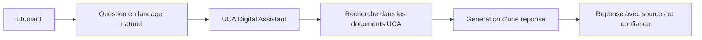

## 2. Probleme traite

Les etudiants peuvent rencontrer plusieurs difficultes :

- les informations sont dispersees entre plusieurs plateformes ;
- certains services ont des noms proches ou peu connus ;
- les procedures sont parfois longues a retrouver ;
- un moteur de recherche classique ne comprend pas toujours l'intention de la question ;
- un simple chatbot LLM peut halluciner s'il ne s'appuie pas sur des documents fiables.

La solution choisie est donc une architecture **RAG** : Retrieval Augmented Generation.

L'idee est simple : le modele ne repond pas seul. Il cherche d'abord dans les documents disponibles, puis il formule une reponse a partir des passages retrouves.

## 3. Principe de la solution

Le systeme fonctionne comme un assistant documentaire intelligent.

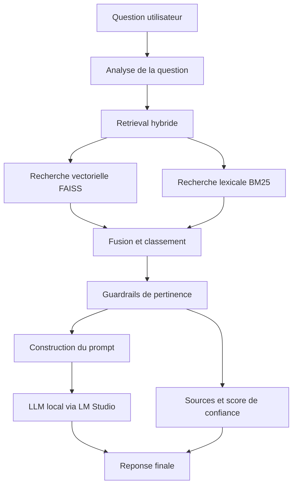

Cette architecture permet de limiter les hallucinations, car la reponse est liee aux documents recuperes.

## 4. Sources documentaires utilisees

Les documents partages sur Drive ont ete exploites comme base de connaissances principale pour les tests recents.

Ils couvrent notamment :

- UC@Student ;
- PEDOC ;
- UCAPLAT ;
- CIP ;
- Espace Diplomes ;
- Mobilite internationale ;
- HPC UCA ;
- Soutien-Recherche ;
- PUCAStaff ;
- Clubs des etudiants ;
- Centre de conferences ;
- Appels a projets.

Ces documents ne sont pas seulement stockes. Ils sont transformes en donnees exploitables par le module RAG.

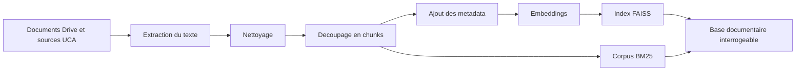

## 5. Architecture technique globale

La solution est integree dans une application Django.

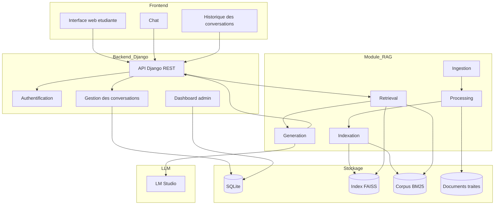

Les technologies principales sont :

| Partie | Technologie utilisee | Role |
|---|---|---|
| Backend | Django | Application web principale |
| API | Django REST Framework | Communication entre interface et backend |
| Base applicative | SQLite | Utilisateurs, conversations, messages |
| Recherche vectorielle | FAISS | Recherche semantique |
| Recherche lexicale | BM25 | Recherche par mots-cles |
| Embeddings | BAAI bge-m3 / Sentence-Transformers | Representation vectorielle des passages |
| Generation | LM Studio | Reponse avec un modele local |
| Interface | HTML, CSS, JavaScript | Espace etudiant et chat |

## 6. Organisation du projet

Le projet est separe en plusieurs parties pour garder une architecture claire.

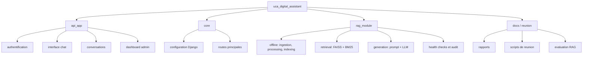

## 7. Fonctionnement offline

La phase offline prepare la base documentaire. Elle est lancee avant l'utilisation par les etudiants.

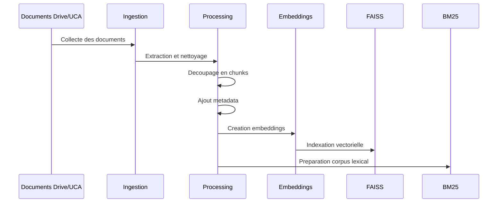

Cette phase permet d'obtenir :

- des chunks propres ;
- des metadata utiles ;
- un index vectoriel ;
- un index lexical ;
- une base documentaire prete a etre interrogee.

## 8. Fonctionnement online

La phase online correspond a l'utilisation reelle par l'etudiant.

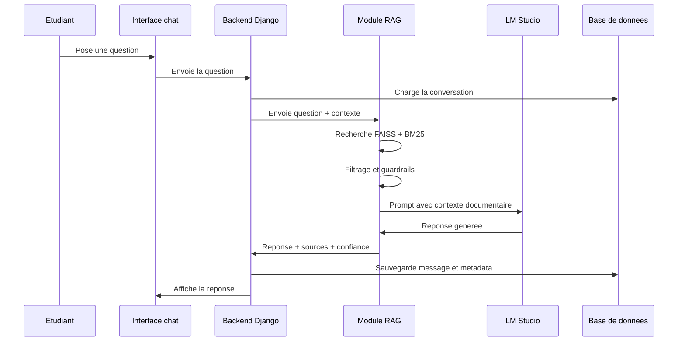

## 9. Gestion du contexte conversationnel

Le projet ne traite pas seulement chaque question de maniere isolee. Il garde aussi un contexte de conversation.

Cela permet de mieux comprendre les questions de suivi.

Exemple :

```text
Utilisateur : Comment fonctionne PEDOC ?
Assistant   : PEDOC permet de gerer les demandes et documents doctoraux...
Utilisateur : Et comment suivre ma demande ?
```

Dans ce cas, la deuxieme question ne contient pas le mot "PEDOC", mais le contexte permet de comprendre que l'utilisateur parle encore du meme service.

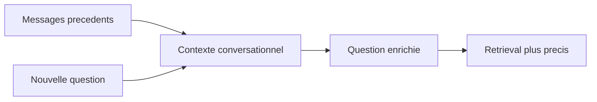

## 10. Fonctionnalites developpees

### Espace etudiant

- inscription ;
- connexion ;
- acces protege au chat ;
- deconnexion ;
- restriction possible aux emails institutionnels.

### Interface de chat

- poser une question en langage naturel ;
- afficher la reponse ;
- afficher les sources ;
- afficher le niveau de confiance ;
- creer une nouvelle conversation ;
- consulter l'historique ;
- renommer ou archiver une conversation ;
- utiliser des questions rapides.

### Module RAG

- ingestion des documents ;
- extraction de texte ;
- nettoyage ;
- chunking ;
- metadata ;
- embeddings ;
- indexation FAISS ;
- recherche BM25 ;
- retrieval hybride ;
- guardrails ;
- prompt final ;
- generation via LM Studio ;
- fallback extractif si le LLM est lent ou indisponible.

### Supervision

- dashboard administrateur ;
- informations sur le corpus ;
- verification de l'index actif ;
- health check RAG ;
- rapports d'audit et d'evaluation.

## 11. Evaluation realisee

Une evaluation a ete faite sur un ensemble de questions construites a partir des documents Drive.

L'objectif etait de comparer :

- la reponse attendue ;
- le document retrouve par le retrieval ;
- la reponse produite par le module RAG.

Resultats actuels :

| Element evalue | Resultat |
|---|---:|
| Questions testees | 20 |
| Documents pertinents retrouves | 18/20 |
| Precision du retrieval | 90 % |
| Score global des reponses | 40/60 |
| Qualite globale des reponses | 66,7 % |

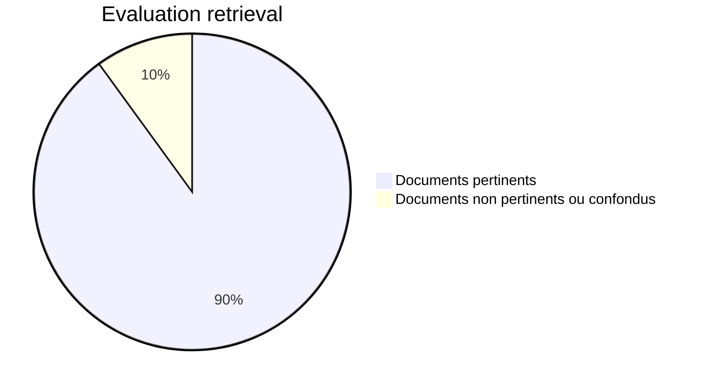

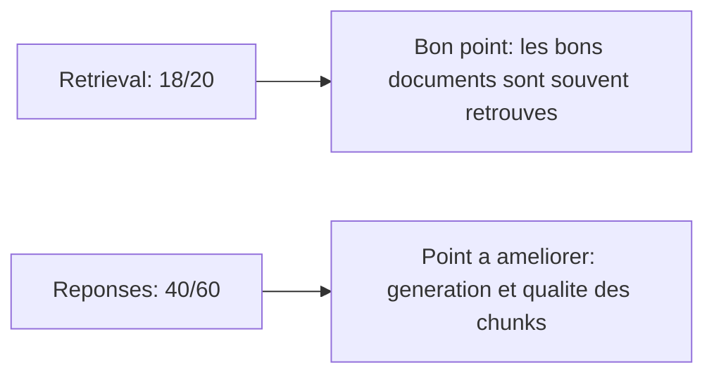

L'evaluation montre que le coeur du module RAG fonctionne correctement. Le retrieval est deja solide. Les limites restantes concernent surtout la generation finale, certains chunks mal alignes et quelques confusions entre services proches.

## 12. Exemple de fonctionnement

Question :

```text
A quoi sert UCAPLAT ?
```

Traitement :

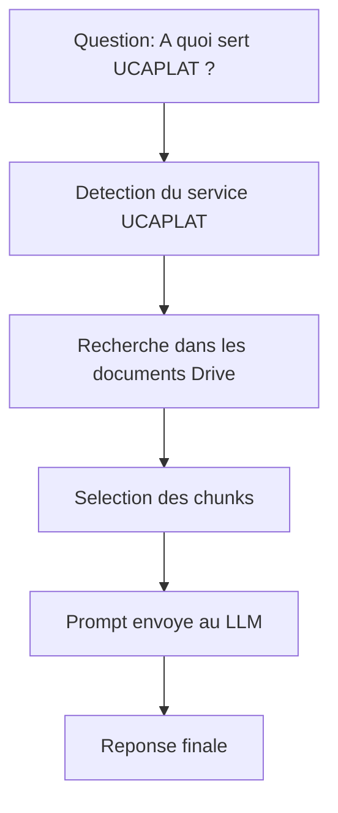

Reponse attendue :

```text
UCAPLAT est une plateforme pedagogique numerique de l'UCA destinee a l'enseignement en ligne. Elle permet la gestion des cours, ressources, activites pedagogiques, devoirs et interactions entre enseignants et etudiants.
```

Ce type de test permet d'identifier si le probleme vient :

- du document retrouve ;
- du chunk selectionne ;
- du prompt ;
- du modele de generation ;
- ou des metadata.

## 13. Limites actuelles

La solution est fonctionnelle, mais certaines limites restent a traiter :

- la base documentaire doit encore etre enrichie ;
- certains documents Drive doivent etre mieux structures ;
- les metadata `service_name` et `file_name` doivent etre plus propres ;
- la generation LM Studio peut etre lente ;
- certaines reponses sont encore trop extractives ;
- des services proches peuvent etre confondus ;
- la version actuelle reste une demonstration locale.

Ces limites ne remettent pas en cause le projet. Elles montrent plutot les axes d'amelioration naturels d'un systeme RAG.

## 14. Ameliorations prevues

Les ameliorations raisonnables sont :

- nettoyer et enrichir les metadata des documents ;
- separer clairement les services proches, par exemple `Club UCA` et `Clubs des etudiants` ;
- ameliorer les seuils de pertinence du retrieval ;
- reduire la taille des prompts pour diminuer la latence ;
- ajouter un retour utilisateur utile / non utile ;
- rendre les sources plus cliquables dans l'interface ;
- preparer une version plus robuste pour la soutenance ;
- presenter Qdrant comme une perspective d'evolution pour une architecture plus scalable.

## 15. Niveau actuel du projet

La solution peut etre presentee comme un **prototype avance et demonstrable**.

Elle integre :

- une application web ;
- une authentification etudiante ;
- un chat intelligent ;
- un historique des conversations ;
- un module RAG complet ;
- une exploitation des documents Drive ;
- des sources et un score de confiance ;
- une evaluation experimentale.

Le projet ne se limite donc pas a une interface de chatbot. Il couvre toute la chaine : collecte documentaire, traitement, indexation, recherche, generation, interface et evaluation.

## 16. Synthese pour le rapport ou la presentation

Phrase courte a utiliser :

> UCA Digital Assistant est une application web intelligente basee sur une architecture RAG. Elle permet aux etudiants de poser des questions en langage naturel et de recevoir des reponses contextualisees a partir de documents UCA, avec affichage des sources, gestion de l'historique et evaluation de la pertinence.

Phrase plus technique :

> La solution combine une application Django, un module RAG, une recherche hybride FAISS + BM25, des embeddings semantiques, une generation locale via LM Studio et une gestion du contexte conversationnel afin de fournir des reponses plus fiables que celles d'un chatbot generatif classique.

Phrase pour defendre les limites :

> Les resultats montrent que le retrieval est deja performant avec 90 % de documents pertinents retrouves. Les ameliorations restantes concernent surtout la qualite des chunks, les metadata et la stabilisation de la generation LLM.

